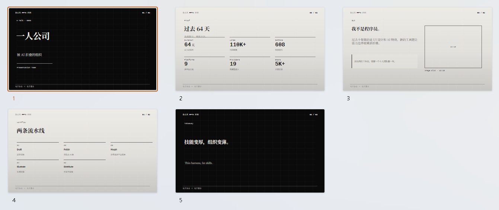
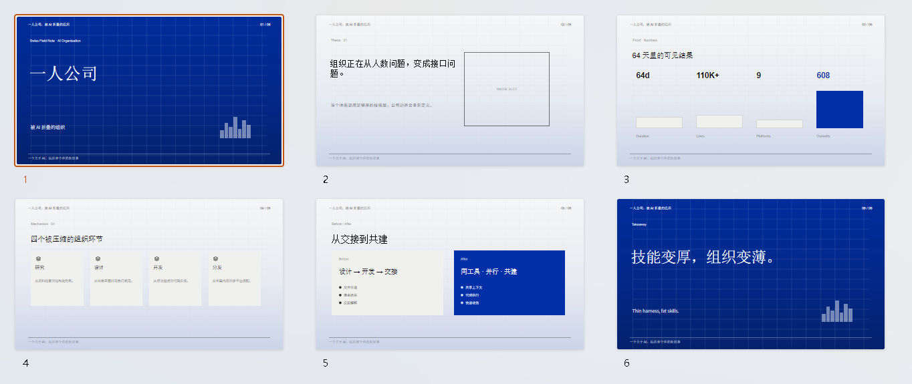
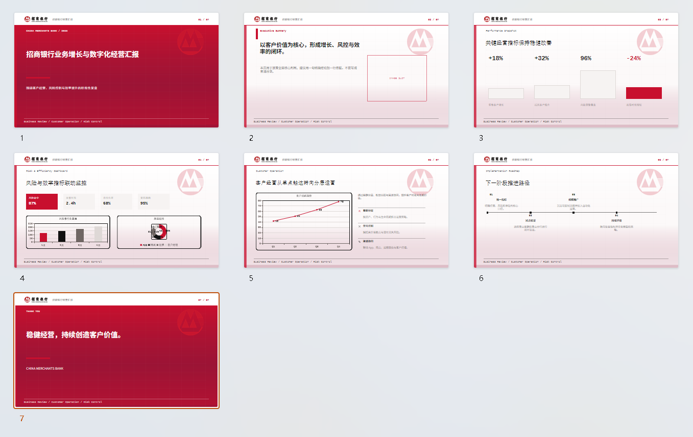

# pptxgenjs-template-generate

本项目借鉴了guizang-ppt中的风格样式, 但没有使用其html文件。当前版本以本仓库 `scripts/pptxgen/` 中的原生 PPTX 生成器、内置 JS 示例模板和 logo 资产为准，生成产物是可编辑 `.pptx` 文件。

基于 `pptxgenjs` 的可编辑 PowerPoint 生成技能。它直接生成 PowerPoint 原生文本框、形状、线条、图片、表格和图表，便于后续在 PowerPoint/WPS 中继续编辑。

感谢 [op7418/guizang-ppt-skill](https://github.com/op7418/guizang-ppt-skil) 中的优秀样式和设计风格。
感谢 [gitbrent/PptxGenJS](https://github.com/gitbrent/PptxGenJS/) 提供 PPTX 生成能力。

当前版本包含三套可切换风格、统一的 JSON spec 输入、内置样例、图片/图表槽位校验、布局多样性提示、CMB 招商银行独立品牌风格，以及 PPTX 原生结构和布局风险校验脚本。

## 文件结构与作用

当前版本的核心文件结构如下。`git ls-files` 中未包含的 `outputs/`、`assets/outputs/` 和 `.idea/` 属于本地生成物或 IDE 配置，不是技能运行所必需的源码。

```text
pptxgenjs-template-generate/
|-- SKILL.md
|-- README.md
|-- package.json
|-- scripts/
|   |-- generate-pptx.js              # CLI and compatibility export entry
|   |-- validate-pptx-native.js
|   |-- validate-pptx-layout.js
|   `-- pptxgen/
|       |-- ARCHITECTURE.md           # module and engine guide
|       |-- index.js                  # public module exports
|       |-- cli.js                    # CLI orchestration
|       |-- engine.js                 # PPTX rendering runtime and layout renderers
|       |-- config.js                 # style/theme/font/icon/page constants
|       |-- spec-io.js                # JSON loading, loose repair, normalized output
|       |-- samples.js                # built-in --sample specs
|       `-- errors.js                 # shared fail helper
|-- assets/
|   |-- template-magazine.js
|   |-- template-swiss.js
|   |-- template-cmb.js
|   |-- template-cmb-all-layouts.js
|   `-- logos/
|       |-- cmb-logo-lockup.png
|       `-- cmb-logo-mark.svg
|-- outputs/              # local generated files; do not commit
`-- assets/outputs/       # sample PPTX outputs; do not commit
```

核心文件作用：

- `SKILL.md`：Agent 使用本技能时读取的主说明文件，包含触发场景、生成流程、JSON spec 约束、layout 规则和校验步骤。
- `README.md`：面向仓库维护和使用者的概览文档，说明安装、运行、文件结构和当前能力边界。
- `package.json`：Node 依赖和快捷命令入口，包含 `sample:*`、`validate:*` 等脚本命令。
- `scripts/generate-pptx.js`: thin CLI and compatibility entry. Existing templates can still `require('../scripts/generate-pptx.js')` and call `buildDeck`.
- `scripts/pptxgen/index.js`: public module export surface for `buildDeck`, `sampleSpec`, JSON parsing, and normalized spec helpers.
- `scripts/pptxgen/cli.js`: CLI orchestration after arguments are parsed: load spec, normalize spec, write normalized spec, and build the deck.
- `scripts/pptxgen/engine.js`: PPTX rendering runtime. Layout renderers, media/chart/table insertion, slot checks, and readability logic live here.
- `scripts/pptxgen/config.js`: style/theme registry, default themes, fonts, slide constants, icon aliases, and readability constants. Add new style/theme configuration here first.
- `scripts/pptxgen/spec-io.js`: JSON spec loading, loose JSON repair, quote/comment/trailing-comma handling, and normalized spec output.
- `scripts/pptxgen/samples.js`: built-in sample specs used by `--sample`. Add a sample here when adding a new style.
- `scripts/pptxgen/errors.js`: shared fail helper.
- `scripts/pptxgen/ARCHITECTURE.md`: module responsibility, engine section map, and style/layout extension guide.
- `scripts/validate-pptx-native.js`：校验 PPTX 是否包含原生 PowerPoint 结构，避免输出整页截图型文件。
- `scripts/validate-pptx-layout.js`：扫描生成后的 PPTX 结构，检查明显的布局冲突、文本覆盖和底部安全区风险。
- `assets/template-magazine.js`：`magazine` 风格样例 spec，适合作为电子杂志/叙事型页面的输入参考。
- `assets/template-swiss.js`：`swiss` 风格样例 spec，适合作为数据、科技、方法论页面的输入参考。
- `assets/template-cmb.js`：招商银行 `cmb` 独立风格样例 spec，内置 CMB logo 配置和金融汇报页面结构。
- `assets/template-cmb-all-layouts.js`：CMB 全 layout QA 生成入口，用于一次性生成所有支持页面类型，便于人工检查排版。
- `assets/logos/cmb-logo-lockup.png`：CMB 页眉使用的白底完整 logo。
- `assets/logos/cmb-logo-mark.svg`：CMB 页眉外装饰和水印使用的透明纯图 logo。
- `outputs/`：本地测试输出目录，例如临时 spec、normalized JSON 和生成 PPTX。
- `assets/outputs/`：样例模板脚本默认写入的 PPTX 输出目录。
## 安装

建议使用 Node.js 18 或更高版本。

```bash
npm install
```

主要依赖：

- `pptxgenjs`：生成可编辑 `.pptx`
- `lucide`：为分点、卡片、指标等元素提供图标

## 生成 PPTX

使用 JSON spec 生成：

```bash
node scripts/generate-pptx.js --spec path/to/deck.json --out outputs/deck.pptx
```

生成内置样例：

```bash
npm run sample:magazine
npm run sample:swiss
npm run sample:cmb
```

生成 CMB 全 layout 检查文件：

```bash
npm run sample:cmb:layouts
```

输出位置：

```text
assets/outputs/deck-cmb-all-layouts.pptx
```

## 校验

生成后建议执行：

```bash
node scripts/validate-pptx-native.js path/to/deck.pptx
node scripts/validate-pptx-layout.js path/to/deck.pptx
```

- `validate-pptx-native.js`：检查是否为 PowerPoint 原生结构，避免整页截图伪装成 PPTX。
- `validate-pptx-layout.js`：检查明显布局风险，例如文本覆盖、元素冲突和底部安全区问题。

修改技能结构后可运行：

```bash
python path/to/skill-creator/scripts/quick_validate.py path/to/pptxgenjs-template-generate
```

## 示例预览

每个示例目录包含一个可编辑 PPTX 和一张全页面拼图截图，便于快速查看当前 style 的整体效果。

### Magazine

[下载 PPTX](example/magazine/magazine-example.pptx)



### Swiss

[下载 PPTX](example/swiss/swiss-example.pptx)



### CMB

[下载 PPTX](example/cmb/cmb-example.pptx)



## 支持风格

- `magazine`：电子杂志 / 电子墨水风格，适合观点、叙事、报告型页面。
- `swiss`：瑞士国际主义风格，适合科技、数据、方法论和产品说明。
- `cmb`：招商银行独立品牌风格，适合银行、金融、经营汇报和商务汇报。

默认主题：

- `magazine`: `ink`
- `swiss`: `ikb`
- `cmb`: `classic`

CMB 风格使用技能内置 logo 资源：

- 页眉完整白底 PNG logo：`logos/cmb-logo-lockup.png`
- 页眉外透明 SVG 纯图 logo：`logos/cmb-logo-mark.svg`

生成器会自动从 `assets/logos/` 解析这些资源，不需要把 logo 手动复制到项目目录。所有 logo 都按原比例显示，避免被压扁。

## JSON Spec 示例

所有 spec 文件建议保存为 UTF-8。不要手写拼接 JSON 字符串，优先由程序对象调用 `JSON.stringify(data, null, 2)` 写出。

```json
{
  "title": "招商银行经营汇报",
  "subtitle": "Business Review",
  "style": "cmb",
  "theme": "classic",
  "logoHeader": "logos/cmb-logo-lockup.png",
  "logoMark": "logos/cmb-logo-mark.svg",
  "slides": [
    {
      "layout": "cover",
      "kicker": "CHINA MERCHANTS BANK / 2026",
      "title": "业务增长与数字化经营汇报",
      "subtitle": "围绕客户经营、风险控制与效率提升"
    },
    {
      "layout": "media",
      "kicker": "Customer Operation",
      "title": "客户经营从单点触达转向分层运营",
      "body": "通过客群分层、权益匹配与渠道协同，提升客户转化与长期价值。",
      "chart": {
        "chartType": "line",
        "title": "客户活跃趋势",
        "labels": ["Q1", "Q2", "Q3", "Q4"],
        "values": [42, 51, 63, 78]
      },
      "items": [
        { "icon": "users", "title": "客户分层", "body": "按资产、行为与生命周期拆分运营策略。" },
        { "icon": "workflow", "title": "渠道协同", "body": "联动 App、网点、远程服务与客户经理。" }
      ]
    }
  ]
}
```

JSON 引号与编码规则：

- 文件统一使用 UTF-8。
- 普通中文内容里的引号优先使用 `「」` 或中文弯引号。
- 如果 JSON 字符串中必须使用英文直引号 `"`，必须写成 `\"`。
- `--spec` 读取时会尝试修复常见问题：Markdown fenced code block、UTF-8 BOM、注释、尾逗号、部分中英文弯引号。
- 若需要把修复后的内容落盘为严格 JSON，使用 `--write-normalized-spec path/to/normalized.json`。

## 常用 Layout

三套风格支持统一的常用 layout 名称，切换模板时优先只修改顶层 `style` / `theme`。

- 封面与章节：`cover`、`section`、`closing`
- 结论页：`statement`、`bigQuote`
- 数据页：`kpiTower`、`bigNumbers`、`dashboard`、`chart`、`dataSheet`
- 图文页：`media`、`mediaGrid`、`gallery`、`imageGrid`、`imageHero`、`quoteImage`、`textImage`
- 结构页：`compare`、`duoCompare`、`timeline`、`pipeline`、`roadmap`、`textGrid`、`article`、`fourCards`、`matrix`、`agenda`、`caseStudy`、`pyramid`、`radial`、`swimlane`

Layout slot limits and renderer behavior are now maintained in `scripts/pptxgen/engine.js`; style/theme design configuration is centralized in `scripts/pptxgen/config.js`. The generator checks text, image, chart, and table slots before output to avoid missing or mismatched content.

## 图片、图表和占位符

- 用户提供 `image` / `images` / `gallery` 时优先插入用户图片。
- `mediaGrid` / `gallery` / `imageGrid` 未显式设置 `mediaCount` 时，槽位数自动等于图片数、显式图表数或 caption 数。
- 显式设置 `mediaCount` 时必须与图片数量匹配，除非明确允许空槽。
- 没有用户图片但提供 `chart` / `charts` 时，使用 PowerPoint 原生图表。
- 没有图片和显式图表时，显示 `IMAGE SLOT` 占位符，不再默认填充图表。
- `statement` 只支持 1 个图片槽位，不支持 chart；多图请使用 `mediaGrid` / `imageGrid`。

图表类型支持：

```text
bar, column, line, pie, doughnut, area, radar, scatter
```

## 布局多样性

规划 deck 时应避免连续 3 页以上使用同一 layout 或同一视觉节奏。生成器默认只输出重复 layout 的替换建议，不会擅自修改输入 JSON，保证 JSON 与 PPTX 一致。

如果确实要自动改 layout，必须同时使用：

```bash
node scripts/generate-pptx.js --spec path/to/deck.json --out outputs/deck.pptx --diversify-layouts --write-normalized-spec outputs/deck.normalized.json
```

后续应以 normalized JSON 作为真实源文件。

## 推荐开发检查流程

修改模板或生成器后建议执行：

```bash
node --check scripts/generate-pptx.js
node --check scripts/pptxgen/cli.js
node --check scripts/pptxgen/config.js
node --check scripts/pptxgen/engine.js
node --check scripts/pptxgen/spec-io.js
node --check scripts/pptxgen/samples.js
npm run sample:magazine
npm run sample:swiss
npm run sample:cmb
npm run sample:cmb:layouts
node scripts/validate-pptx-native.js assets/outputs/deck-cmb-all-layouts.pptx
node scripts/validate-pptx-layout.js assets/outputs/deck-cmb-all-layouts.pptx
```

`outputs/` 和 `assets/outputs/` 是生成物目录，不建议提交。

## 已知边界

- 这是原生 PPTX 生成器，不承诺跨 PowerPoint/WPS/Keynote 的像素级一致。
- PowerPoint 与 WPS 的字体渲染可能不同，长文本仍建议拆页或减少分点。
- 后置插入的 `blocks`、`charts`、`tables` 若缺少显式 `x/y/w/h` 会被跳过并打印 warning，避免与正文重叠。
- 自动 layout 多样化会改变页面类型，必须配合 `--write-normalized-spec` 使用。


